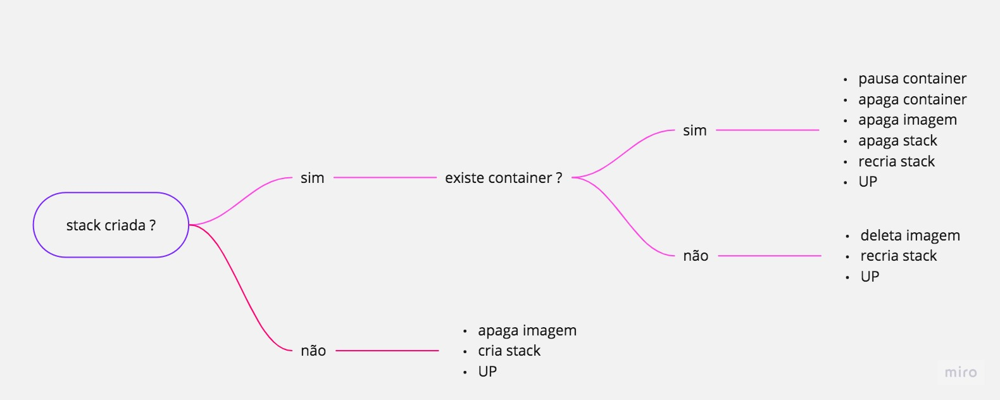

# deploy


```
-
        name: Deploy
        uses: Hugollemos/deploy@v1
        env:
          API_URL: ${{ secrets.API_URL }}
          API_KEY: ${{ secrets.API_KEY }}
          FILE_PATH: "./docker-compose.yml"
          STACK_NAME: portal
          ENDPOINT: 2
          CONTAINER_NAME: portal_intra
          tags: "imagem/teste:latest" 
          api_docker: ${{ secrets.api_docker }}
```
# Action para realiazar o deploy das stacks para o portainer.
## Entendendo o fluxo.

